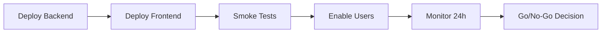

# VendHub Manager - ACTION PLAN до 100% реализации

> **Дата создания**: 2025-12-21
> **Версия**: 1.0.0
> **Цель**: Полный запуск и бесперебойная работа системы

---

## Оглавление

1. [Текущее состояние проекта](#текущее-состояние-проекта)
2. [Существующие агенты и их функции](#существующие-агенты)
3. [Рекомендуемые новые агенты](#новые-агенты)
4. [Фаза 1: Стабилизация (1-2 недели)](#фаза-1-стабилизация)
5. [Фаза 2: Завершение функционала (2-4 недели)](#фаза-2-завершение)
6. [Фаза 3: Production Launch (1 неделя)](#фаза-3-launch)
7. [Фаза 4: Мониторинг и поддержка](#фаза-4-поддержка)
8. [Чек-лист готовности](#чек-лист)

---

## Текущее состояние проекта

### Общая готовность: **73%**

| Компонент | Готовность | Статус |
|-----------|------------|--------|
| **Backend API** | 95% | Готов к production |
| **Frontend Web** | 62% | Требует доработки |
| **Mobile App** | 25% | Foundation complete |
| **Telegram Bot** | 80% | Нужны команды комиссий |
| **DevOps/Infra** | 90% | Railway deployed |
| **Security** | 87% | 2 moderate vuln (accepted) |
| **Documentation** | 85% | Требует актуализации |
| **Testing** | 65% | Нужны E2E тесты |

### Детальная оценка

#### Backend (95% готов)
- 48+ модулей реализовано
- Все CRUD операции работают
- Система комиссий (Phase 1-3 complete)
- BullMQ scheduled jobs настроены
- WebSocket real-time updates
- JWT + 2FA аутентификация
- RBAC с 7 ролями

**Осталось:**
- E2E тесты для commission flow
- Load testing для 1000+ contracts

#### Frontend (62% готов)
- Next.js 16 App Router
- Dashboard с метриками
- Commission management UI
- Real-time charts (Recharts)
- React Query + Zustand

**Осталось:**
- Мобильная адаптация форм
- Улучшение UX
- Дополнительные отчеты

#### Mobile (25% готов)
- Expo 54 + React Native
- Auth flow реализован
- API integration готов
- Navigation настроен

**Осталось (90 часов):**
- Screen implementations
- Offline support
- Push notifications
- Production builds

#### DevOps (90% готов)
- Docker Compose (dev + prod)
- Railway deployment
- Prometheus + Grafana
- Nginx reverse proxy
- Automated backups

**Осталось:**
- CI/CD improvements
- Auto-scaling настройка
- Disaster recovery тест

---

## Существующие агенты

### 1. vendhub-dev-architect
**Файл**: `.claude/agents/vendhub-dev-architect.md`
**Назначение**: Основной архитектурный агент
**Когда использовать**:
- Планирование новых фич
- Реализация модулей по Sprint требованиям
- Code review на соответствие архитектуре
- Database migrations

### 2. vendhub-auth-security
**Файл**: `.claude/agents/vendhub-auth-security.md`
**Назначение**: Безопасность и аутентификация
**Когда использовать**:
- JWT token management
- RBAC настройка
- 2FA implementation
- Security audits
- Rate limiting

### 3. vendhub-database-expert
**Файл**: `.claude/agents/vendhub-database-expert.md`
**Назначение**: База данных и миграции
**Когда использовать**:
- Создание миграций
- Оптимизация запросов
- Индексы и партиционирование
- Data integrity

### 4. vendhub-frontend-specialist
**Файл**: `.claude/agents/vendhub-frontend-specialist.md`
**Назначение**: Frontend разработка
**Когда использовать**:
- React компоненты
- Next.js pages
- State management
- UI/UX improvements

### 5. vendhub-telegram-bot
**Файл**: `.claude/agents/vendhub-telegram-bot.md`
**Назначение**: Telegram бот
**Когда использовать**:
- Новые команды
- Inline keyboards
- Notifications
- Onboarding flow

### 6. vendhub-tester
**Файл**: `.claude/agents/vendhub-tester.md`
**Назначение**: Тестирование
**Когда использовать**:
- Unit tests
- Integration tests
- E2E tests (Playwright)
- Coverage improvement

### 7. vendhub-api-developer
**Файл**: `.claude/agents/vendhub-api-developer.md`
**Назначение**: API разработка
**Когда использовать**:
- REST endpoints
- DTOs и validation
- Swagger documentation
- API versioning

---

## Новые агенты (рекомендуемые)

### 8. vendhub-devops (СОЗДАТЬ)
**Назначение**: DevOps и инфраструктура
**Когда использовать**:
- Docker configuration
- Railway deployment
- CI/CD pipelines
- Monitoring setup
- Backup strategies

### 9. vendhub-mobile (СОЗДАТЬ)
**Назначение**: Mobile разработка
**Когда использовать**:
- Expo/React Native screens
- Offline mode
- Push notifications
- Camera integration
- GPS tracking

### 10. vendhub-qa-lead (СОЗДАТЬ)
**Назначение**: Качество и release management
**Когда использовать**:
- Release planning
- Bug triage
- Regression testing
- Performance testing
- Production verification

---

## Фаза 1: Стабилизация (1-2 недели)

### Цель: Исправить критичные баги и подготовить к production

### 1.1 Backend стабилизация
**Приоритет**: КРИТИЧЕСКИЙ

- [ ] Запустить полный test suite
  ```bash
  cd backend && npm run test:cov
  ```
- [ ] Исправить все failing tests
- [ ] Проверить все API endpoints через Swagger
- [ ] Валидация BullMQ jobs работает
- [ ] Проверить commission calculations

### 1.2 Frontend стабилизация
**Приоритет**: КРИТИЧЕСКИЙ

- [ ] Запустить build
  ```bash
  cd frontend && npm run build
  ```
- [ ] Исправить TypeScript ошибки
- [ ] Проверить все роуты доступны
- [ ] Валидация форм работает
- [ ] Real-time updates работают

### 1.3 Security check
**Приоритет**: КРИТИЧЕСКИЙ

- [ ] npm audit в backend
- [ ] npm audit в frontend
- [ ] Проверить все endpoints требуют auth
- [ ] Rate limiting работает
- [ ] CORS настроен правильно

### 1.4 Environment setup
**Приоритет**: ВЫСОКИЙ

- [ ] .env.production актуален
- [ ] Все secrets в Railway
- [ ] Database migrations applied
- [ ] Redis configured

---

## Фаза 2: Завершение функционала (2-4 недели)

### 2.1 Sprint: Mobile App (90 часов)

**Неделя 1-2**: Core Screens
- [ ] TaskListScreen (фильтры, поиск)
- [ ] TaskDetailScreen (статусы, действия)
- [ ] TaskCameraScreen (фото до/после)
- [ ] EquipmentMapScreen (Leaflet/MapView)
- [ ] ProfileScreen (logout, настройки)

**Неделя 3**: Offline + Notifications
- [ ] Offline queue system
- [ ] Network detection
- [ ] Auto-sync service
- [ ] Push notification registration
- [ ] Location tracking

**Неделя 4**: Polish + Testing
- [ ] Unit tests
- [ ] Integration tests
- [ ] Performance optimization
- [ ] Production builds (iOS/Android)

### 2.2 Sprint: Telegram Bot Enhancement (20 часов)

- [ ] /commissions command
- [ ] /overdue command
- [ ] /calculate command
- [ ] Inline keyboards для комиссий
- [ ] Уведомления о просрочке

### 2.3 Sprint: E2E Testing (40 часов)

- [ ] Playwright setup
- [ ] Auth flow tests
- [ ] Task completion tests
- [ ] Commission calculation tests
- [ ] Critical paths coverage 100%

### 2.4 Sprint: Documentation (16 часов)

- [ ] User guide (RU)
- [ ] Admin manual
- [ ] API reference update
- [ ] Troubleshooting guide
- [ ] Video tutorials (optional)

---

## Фаза 3: Production Launch (1 неделя)

### 3.1 Pre-launch checklist

#### День 1-2: Final testing
- [ ] Smoke tests на staging
- [ ] Load testing (k6/Locust)
- [ ] Security scan (OWASP ZAP)
- [ ] Database backup verified
- [ ] Rollback plan documented

#### День 3-4: Production deployment
- [ ] Deploy backend to Railway
- [ ] Deploy frontend to Vercel/Railway
- [ ] Configure production domain
- [ ] SSL certificates active
- [ ] Monitoring dashboards ready

#### День 5: Verification
- [ ] All endpoints responding
- [ ] Real users can login
- [ ] First task created successfully
- [ ] Telegram bot responding
- [ ] Metrics flowing to Grafana

### 3.2 Launch day activities



---

## Фаза 4: Мониторинг и поддержка

### 4.1 First Week (Hypercare)

- [ ] 24/7 мониторинг error rates
- [ ] Daily backups verified
- [ ] User feedback collection
- [ ] Hot fixes if needed
- [ ] Performance baseline

### 4.2 Ongoing Operations

#### Daily
- [ ] Check Grafana dashboards
- [ ] Review error logs
- [ ] Check queue health

#### Weekly
- [ ] Security scan
- [ ] Performance review
- [ ] Backup verification
- [ ] Update dependencies

#### Monthly
- [ ] Capacity planning
- [ ] Cost optimization
- [ ] Feature prioritization
- [ ] Security audit

### 4.3 SLA Targets

| Metric | Target | Alert Threshold |
|--------|--------|-----------------|
| Uptime | 99.9% | < 99.5% |
| API Response | < 500ms p95 | > 1s |
| Error Rate | < 1% | > 5% |
| Queue Backlog | < 100 jobs | > 1000 |

---

## Чек-лист готовности к 100%

### Backend
- [x] All modules implemented
- [x] Authentication + 2FA
- [x] RBAC working
- [x] Commission automation
- [x] BullMQ jobs
- [x] WebSocket gateway
- [ ] E2E tests complete
- [ ] Load testing passed

### Frontend
- [x] Dashboard working
- [x] Commission pages
- [x] Real-time updates
- [ ] Mobile responsive 100%
- [ ] All forms validated
- [ ] Performance optimized

### Mobile
- [x] Project setup
- [x] Auth flow
- [x] API integration
- [ ] All screens
- [ ] Offline mode
- [ ] Push notifications
- [ ] App Store ready

### Infrastructure
- [x] Railway backend
- [x] Railway frontend
- [x] PostgreSQL
- [x] Redis
- [x] Prometheus/Grafana
- [ ] CDN configured
- [ ] Auto-scaling
- [ ] DR tested

### Documentation
- [x] CLAUDE.md
- [x] API docs (Swagger)
- [x] Deployment guide
- [ ] User manual
- [ ] Video tutorials

---

## Timeline Summary

```
Week 1-2:   Фаза 1 - Стабилизация
Week 3-6:   Фаза 2 - Завершение функционала
Week 7:     Фаза 3 - Production Launch
Week 8+:    Фаза 4 - Мониторинг и поддержка
```

**Estimated Total: 8 недель до 100%**

---

## Quick Commands

### Backend
```bash
cd backend
npm run test:cov          # Tests with coverage
npm run lint              # Lint check
npm run build             # Production build
npm run migration:run     # Apply migrations
npm run start:prod        # Start production
```

### Frontend
```bash
cd frontend
npm run build             # Production build
npm run test              # Run tests
npm run lint              # Lint check
npm run storybook         # Component docs
```

### Mobile
```bash
cd mobile
npm run start             # Start Expo
npm run android           # Run on Android
npm run ios               # Run on iOS
eas build                 # Create production build
```

### Railway
```bash
railway up                # Deploy
railway logs              # View logs
railway variables         # Manage env vars
railway redeploy          # Force redeploy
```

---

## Risk Register

| Risk | Impact | Probability | Mitigation |
|------|--------|-------------|------------|
| Mobile app delays | Medium | High | Focus on web first |
| Security vulnerability | High | Low | Regular audits |
| Performance issues | High | Medium | Load testing |
| Data loss | Critical | Low | Daily backups |
| Third-party API down | Medium | Low | Fallback mechanisms |

---

## Контакты и ресурсы

- **Repository**: VHM24-repo
- **Swagger**: http://localhost:3000/api/v1/docs
- **Grafana**: http://localhost/grafana
- **Bull Board**: http://localhost/admin/queues
- **Storybook**: http://localhost:6006

---

**Статус документа**: ACTIVE
**Последнее обновление**: 2025-12-21
**Следующий review**: 2025-01-15
