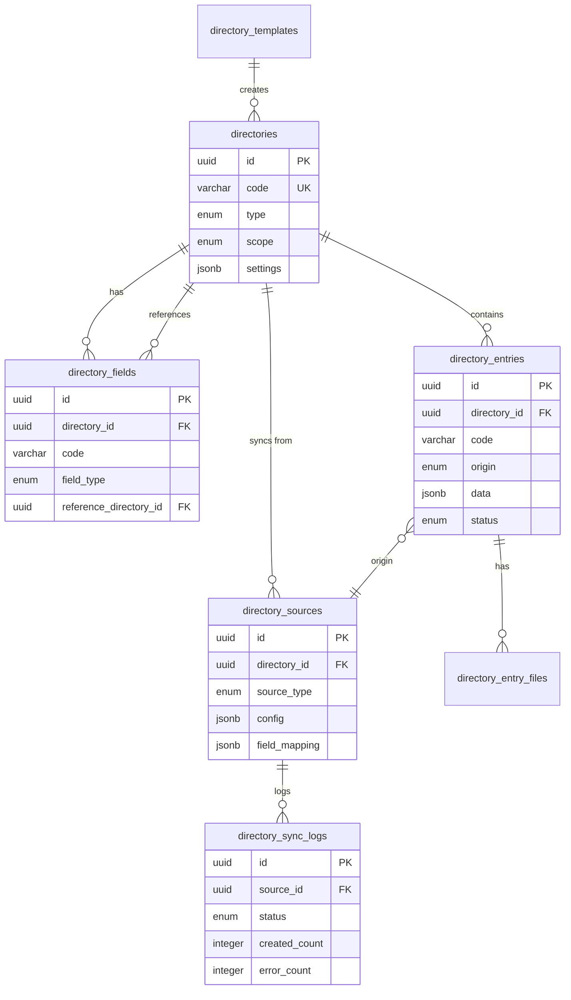

# VHM24 Directory System Architecture

> **Version**: 1.0.0
> **Last Updated**: 2025-01-20
> **Status**: Design Specification

## Table of Contents

1. [Overview](#overview)
2. [Directory Types](#directory-types)
3. [Database Schema](#database-schema)
4. [Entity Relationships](#entity-relationships)
5. [API Endpoints](#api-endpoints)
6. [Frontend Screens](#frontend-screens)
7. [Inline Create Flow](#inline-create-flow)

---

## Overview

The Directory System is a unified layer for managing all reference data in VHM24. It provides:

- **Unified management** of all lookup/reference data
- **Flexible field definitions** for custom attributes
- **External data sources** with auto-sync capabilities
- **Origin tracking** (OFFICIAL vs LOCAL entries)
- **Inline creation** for seamless UX
- **Template-based** quick setup for common directory types

### Design Principles

1. **Everything selectable is a directory** - Any dropdown, autocomplete, or selection uses directories
2. **Cards with parameters** - Entries have flexible fields/parameters
3. **Never lose data** - Soft deletes, archiving instead of deletion
4. **Clear origin** - Every entry shows if it's official or manually added
5. **Inline creation** - Add missing values without leaving context

---

## Directory Types

### 1. Internal (Manual / User-managed)

User-created and maintained directories for business entities.

**Examples**: Products, Ingredients, Locations, Machines, Spare Parts, Counterparties

**Characteristics**:
- Full CRUD access for authorized users
- Entries created as "cards" with flexible parameters
- All entries are LOCAL origin

### 2. External (Auto-updated from sources)

Directories populated from external official sources.

**Examples**: IKPU classifier, Bank MFO codes, Official catalogs

**Characteristics**:
- OFFICIAL entries are read-only
- Supports URL/API/File/Manual import sources
- Auto-sync on schedule or manual trigger
- Full sync history and logging

### 3. External + Local Overlay

External directories that allow local additions.

**Structure**:
```
┌─────────────────────────────────────────┐
│          Directory Entries              │
├─────────────────────────────────────────┤
│  🛡 OFFICIAL Layer (read-only)          │
│  - Source: External API/File            │
│  - Cannot edit or delete                │
├─────────────────────────────────────────┤
│  ✍️ LOCAL Layer (user-managed)          │
│  - Added manually by users              │
│  - Full edit/archive access             │
└─────────────────────────────────────────┘
```

### 4. Parametric (Reference Lists)

Simple value lists used as sources for field selections.

**Examples**: Manufacturers, Cup Types, Equipment Types, Categories

**Characteristics**:
- Lightweight structure
- Used in field definitions as value sources
- Can be internal or external

### 5. Template-based

Directories created from predefined templates with ready structure.

**Available Templates**:
- `machine_types` - Machine type catalog
- `products` - Product catalog
- `ingredients` - Ingredient catalog
- `locations` - Location directory
- `spare_parts` - Spare parts catalog
- `work_types` - Service operation types
- `payment_providers` - Payment provider list

---

## Database Schema

### Entity Overview

```
┌─────────────────┐      ┌──────────────────┐
│   directories   │─────<│ directory_fields │
│                 │      │                  │
│ type, scope     │      │ field_type       │
│ settings        │      │ validation       │
└────────┬────────┘      └──────────────────┘
         │
         │ 1:N
         ▼
┌─────────────────┐      ┌──────────────────┐
│directory_entries│─────>│directory_sources │
│                 │      │                  │
│ origin, data    │      │ source_type      │
│ status          │      │ sync_config      │
└────────┬────────┘      └────────┬─────────┘
         │                        │
         │                        ▼
         │               ┌──────────────────┐
         │               │directory_sync_   │
         │               │     logs         │
         ▼               │                  │
┌─────────────────┐      │ status, counts   │
│directory_entry_ │      └──────────────────┘
│    files        │
│                 │
│ file references │
└─────────────────┘
```

### Table: `directories`

Main directory definitions.

| Column | Type | Nullable | Description |
|--------|------|----------|-------------|
| id | uuid | PK | Primary key |
| code | varchar(100) | No | Unique identifier (slug) |
| name_ru | varchar(200) | No | Russian name |
| name_en | varchar(200) | Yes | English name |
| description | text | Yes | Description |
| type | enum | No | `internal`, `external`, `external_with_local`, `parametric`, `template` |
| scope | enum | No | `global`, `organization`, `location` |
| organization_id | uuid | Yes | For org-scoped directories |
| location_id | uuid | Yes | For location-scoped directories |
| template_code | varchar(50) | Yes | Source template if created from template |
| icon | varchar(50) | Yes | Icon identifier for UI |
| color | varchar(20) | Yes | Color code for UI |
| settings | jsonb | Yes | UI and behavior settings |
| is_system | boolean | No | System directory (no delete) |
| is_active | boolean | No | Active status |
| sort_order | integer | No | Display order |
| created_at | timestamptz | No | Creation timestamp |
| updated_at | timestamptz | No | Last update |
| deleted_at | timestamptz | Yes | Soft delete |
| created_by_id | uuid | Yes | Creator user |
| updated_by_id | uuid | Yes | Last updater |

**Settings JSONB Structure**:
```typescript
interface DirectorySettings {
  // Display settings
  tableColumns: string[];        // Fields to show in table
  cardLayout: 'default' | 'compact' | 'detailed';
  showOriginBadge: boolean;      // Show OFFICIAL/LOCAL badge

  // Behavior settings
  allowLocalAdditions: boolean;  // For external directories
  requireApproval: boolean;      // New entries need approval
  allowInlineCreate: boolean;    // Enable inline creation

  // Search settings
  searchableFields: string[];    // Fields for full-text search
  defaultSort: { field: string; order: 'asc' | 'desc' };
}
```

### Table: `directory_fields`

Field definitions for directory entries.

| Column | Type | Nullable | Description |
|--------|------|----------|-------------|
| id | uuid | PK | Primary key |
| directory_id | uuid | FK | Parent directory |
| code | varchar(100) | No | Field identifier |
| name_ru | varchar(200) | No | Russian label |
| name_en | varchar(200) | Yes | English label |
| description | text | Yes | Help text |
| field_type | enum | No | Data type |
| reference_directory_id | uuid | Yes | For `reference` type |
| options | jsonb | Yes | For `select` type - options list |
| validation | jsonb | Yes | Validation rules |
| default_value | jsonb | Yes | Default value |
| is_required | boolean | No | Required field |
| is_unique | boolean | No | Unique constraint |
| is_searchable | boolean | No | Include in search |
| show_in_table | boolean | No | Show in list view |
| show_in_card | boolean | No | Show in detail view |
| sort_order | integer | No | Display order |
| is_system | boolean | No | System field (no delete) |
| is_active | boolean | No | Active status |
| created_at | timestamptz | No | Creation timestamp |
| updated_at | timestamptz | No | Last update |

**Field Types**:
```typescript
enum DirectoryFieldType {
  TEXT = 'text',              // Single line text
  TEXTAREA = 'textarea',      // Multi-line text
  NUMBER = 'number',          // Numeric value
  DECIMAL = 'decimal',        // Decimal number
  BOOLEAN = 'boolean',        // Yes/No
  DATE = 'date',              // Date only
  DATETIME = 'datetime',      // Date and time
  SELECT = 'select',          // Fixed options list
  MULTISELECT = 'multiselect',// Multiple selections
  REFERENCE = 'reference',    // Reference to another directory
  FILE = 'file',              // File attachment
  IMAGE = 'image',            // Image file
  URL = 'url',                // URL/Link
  EMAIL = 'email',            // Email address
  PHONE = 'phone',            // Phone number
  JSON = 'json',              // Arbitrary JSON
}
```

**Validation JSONB Structure**:
```typescript
interface FieldValidation {
  // Text validations
  minLength?: number;
  maxLength?: number;
  pattern?: string;           // Regex pattern

  // Number validations
  min?: number;
  max?: number;
  precision?: number;         // Decimal places

  // Select validations
  allowCustom?: boolean;      // Allow values not in options

  // File validations
  maxSize?: number;           // In bytes
  allowedTypes?: string[];    // MIME types

  // Custom validation
  customValidator?: string;   // Validator function name
}
```

### Table: `directory_entries`

Actual data entries in directories.

| Column | Type | Nullable | Description |
|--------|------|----------|-------------|
| id | uuid | PK | Primary key |
| directory_id | uuid | FK | Parent directory |
| code | varchar(200) | No | Unique code within directory |
| name_ru | varchar(500) | No | Russian display name |
| name_en | varchar(500) | Yes | English display name |
| origin | enum | No | `official` or `local` |
| source_id | uuid | Yes | For official - source reference |
| external_id | varchar(200) | Yes | ID in external system |
| data | jsonb | No | Field values (key-value pairs) |
| status | enum | No | `active`, `archived`, `pending_approval` |
| approval_status | enum | Yes | `pending`, `approved`, `rejected` |
| approved_by_id | uuid | Yes | Approver user |
| approved_at | timestamptz | Yes | Approval timestamp |
| sort_order | integer | No | Display order |
| search_vector | tsvector | Yes | Full-text search index |
| created_at | timestamptz | No | Creation timestamp |
| updated_at | timestamptz | No | Last update |
| deleted_at | timestamptz | Yes | Soft delete |
| created_by_id | uuid | Yes | Creator user |
| updated_by_id | uuid | Yes | Last updater |

**Data JSONB Structure**:
```typescript
// Keys are field codes from directory_fields
interface EntryData {
  [fieldCode: string]: any;
}

// Example for a Machine Type entry:
{
  "manufacturer": "uuid-of-manufacturer-entry",
  "cup_types": ["200ml", "300ml"],
  "has_refrigeration": true,
  "max_selections": 32,
  "dimensions": { "width": 80, "height": 180, "depth": 70 }
}
```

### Table: `directory_sources`

External data source configurations.

| Column | Type | Nullable | Description |
|--------|------|----------|-------------|
| id | uuid | PK | Primary key |
| directory_id | uuid | FK | Target directory |
| name | varchar(200) | No | Source name |
| source_type | enum | No | `url`, `api`, `file`, `manual` |
| config | jsonb | No | Source-specific configuration |
| field_mapping | jsonb | No | Maps source fields to directory fields |
| unique_key_field | varchar(100) | No | Field used for deduplication |
| sync_mode | enum | No | `full`, `incremental` |
| schedule | varchar(100) | Yes | Cron expression for auto-sync |
| is_active | boolean | No | Source active status |
| last_sync_at | timestamptz | Yes | Last successful sync |
| last_sync_status | enum | Yes | `success`, `partial`, `failed` |
| created_at | timestamptz | No | Creation timestamp |
| updated_at | timestamptz | No | Last update |
| created_by_id | uuid | Yes | Creator user |

**Config JSONB by source_type**:
```typescript
// URL source
interface UrlSourceConfig {
  url: string;
  method: 'GET' | 'POST';
  headers?: Record<string, string>;
  responseFormat: 'json' | 'csv' | 'xml';
  dataPath?: string;          // JSONPath to data array
}

// API source
interface ApiSourceConfig {
  baseUrl: string;
  endpoint: string;
  method: 'GET' | 'POST';
  authType: 'none' | 'basic' | 'bearer' | 'api_key';
  authConfig?: {
    username?: string;
    password?: string;        // Encrypted
    token?: string;           // Encrypted
    apiKey?: string;          // Encrypted
    apiKeyHeader?: string;
  };
  pagination?: {
    type: 'offset' | 'cursor' | 'page';
    pageSize: number;
    pageParam: string;
  };
}

// File source
interface FileSourceConfig {
  fileType: 'csv' | 'xlsx' | 'json';
  hasHeader: boolean;
  delimiter?: string;         // For CSV
  sheetName?: string;         // For XLSX
  encoding?: string;
}

// Manual source
interface ManualSourceConfig {
  inputFormat: 'text' | 'json' | 'csv';
  instructions?: string;      // Help text for users
}
```

**Field Mapping JSONB**:
```typescript
interface FieldMapping {
  // Maps source field name to directory field code
  [sourceField: string]: {
    targetField: string;
    transform?: 'none' | 'uppercase' | 'lowercase' | 'trim' | 'custom';
    customTransform?: string; // Function name
  };
}
```

### Table: `directory_sync_logs`

Synchronization history and logs.

| Column | Type | Nullable | Description |
|--------|------|----------|-------------|
| id | uuid | PK | Primary key |
| source_id | uuid | FK | Source reference |
| directory_id | uuid | FK | Directory reference |
| started_at | timestamptz | No | Sync start time |
| completed_at | timestamptz | Yes | Sync end time |
| status | enum | No | `running`, `success`, `partial`, `failed` |
| total_records | integer | Yes | Total records in source |
| created_count | integer | No | New entries created |
| updated_count | integer | No | Existing entries updated |
| skipped_count | integer | No | Skipped (no changes) |
| error_count | integer | No | Entries with errors |
| errors | jsonb | Yes | Error details array |
| triggered_by | enum | No | `schedule`, `manual`, `api` |
| triggered_by_user_id | uuid | Yes | User who triggered |
| created_at | timestamptz | No | Log creation timestamp |

**Errors JSONB Structure**:
```typescript
interface SyncError {
  sourceRecord: any;          // Original source data
  errorType: 'validation' | 'mapping' | 'duplicate' | 'system';
  errorMessage: string;
  fieldErrors?: Record<string, string>;
}
```

### Table: `directory_entry_files`

File attachments for directory entries.

| Column | Type | Nullable | Description |
|--------|------|----------|-------------|
| id | uuid | PK | Primary key |
| entry_id | uuid | FK | Entry reference |
| field_code | varchar(100) | No | Field this file belongs to |
| file_id | uuid | FK | Reference to files table |
| sort_order | integer | No | Display order |
| created_at | timestamptz | No | Creation timestamp |

### Table: `directory_templates`

Predefined templates for common directories.

| Column | Type | Nullable | Description |
|--------|------|----------|-------------|
| id | uuid | PK | Primary key |
| code | varchar(50) | No | Template code |
| name_ru | varchar(200) | No | Russian name |
| name_en | varchar(200) | Yes | English name |
| description | text | Yes | Description |
| icon | varchar(50) | Yes | Icon identifier |
| category | varchar(50) | No | Template category |
| default_fields | jsonb | No | Field definitions |
| default_settings | jsonb | No | Directory settings |
| is_active | boolean | No | Template active status |
| sort_order | integer | No | Display order |
| created_at | timestamptz | No | Creation timestamp |
| updated_at | timestamptz | No | Last update |

---

## Entity Relationships

### ER Diagram (Mermaid)



---

## API Endpoints

### Directories CRUD

```
GET    /api/directories              # List all directories
POST   /api/directories              # Create directory
GET    /api/directories/:id          # Get directory details
PATCH  /api/directories/:id          # Update directory
DELETE /api/directories/:id          # Soft delete directory

GET    /api/directories/code/:code   # Get by code
```

### Directory Fields

```
GET    /api/directories/:id/fields           # List fields
POST   /api/directories/:id/fields           # Add field
PATCH  /api/directories/:id/fields/:fieldId  # Update field
DELETE /api/directories/:id/fields/:fieldId  # Remove field
POST   /api/directories/:id/fields/reorder   # Reorder fields
```

### Directory Entries

```
GET    /api/directories/:id/entries          # List entries (paginated)
POST   /api/directories/:id/entries          # Create entry
GET    /api/directories/:id/entries/:entryId # Get entry
PATCH  /api/directories/:id/entries/:entryId # Update entry
DELETE /api/directories/:id/entries/:entryId # Archive entry

# Inline create (quick add)
POST   /api/directories/:id/entries/quick    # Quick create with minimal data

# Bulk operations
POST   /api/directories/:id/entries/bulk     # Bulk create
PATCH  /api/directories/:id/entries/bulk     # Bulk update
DELETE /api/directories/:id/entries/bulk     # Bulk archive

# Search
GET    /api/directories/:id/entries/search   # Full-text search
```

### Directory Sources

```
GET    /api/directories/:id/sources          # List sources
POST   /api/directories/:id/sources          # Add source
PATCH  /api/directories/:id/sources/:srcId   # Update source
DELETE /api/directories/:id/sources/:srcId   # Remove source

# Sync operations
POST   /api/directories/:id/sources/:srcId/sync  # Trigger sync
GET    /api/directories/:id/sources/:srcId/logs  # Get sync logs
POST   /api/directories/:id/sources/:srcId/preview # Preview sync data
```

### Templates

```
GET    /api/directory-templates              # List templates
GET    /api/directory-templates/:code        # Get template
POST   /api/directory-templates/:code/create # Create directory from template
```

### Quick Lookup (for dropdowns)

```
GET    /api/lookup/:directoryCode            # Quick lookup entries
GET    /api/lookup/:directoryCode/search     # Search entries
```

---

## Frontend Screens

### Directory Builder Wizard

**Route**: `/dashboard/directories/new`

#### Step 1: Type Selection

```
┌─────────────────────────────────────────────────────────────┐
│  Создание справочника                            Step 1/5  │
├─────────────────────────────────────────────────────────────┤
│                                                             │
│  Выберите тип справочника:                                  │
│                                                             │
│  ┌──────────────────┐  ┌──────────────────┐                │
│  │  📝 Внутренний   │  │  🌐 Внешний      │                │
│  │                  │  │                  │                │
│  │  Создаете и      │  │  Данные из       │                │
│  │  ведете вручную  │  │  внешнего        │                │
│  │                  │  │  источника       │                │
│  └──────────────────┘  └──────────────────┘                │
│                                                             │
│  ┌──────────────────┐  ┌──────────────────┐                │
│  │  🔗 Внешний +    │  │  📋 Параметри-   │                │
│  │     Локальные    │  │     ческий       │                │
│  │                  │  │                  │                │
│  │  Внешние данные  │  │  Простой список  │                │
│  │  + свои добавки  │  │  значений        │                │
│  └──────────────────┘  └──────────────────┘                │
│                                                             │
│  ┌──────────────────┐                                      │
│  │  📑 Из шаблона   │                                      │
│  │                  │                                      │
│  │  Готовая         │                                      │
│  │  структура       │                                      │
│  └──────────────────┘                                      │
│                                                             │
│                              [Отмена]  [Далее →]           │
└─────────────────────────────────────────────────────────────┘
```

#### Step 2: Basic Info

```
┌─────────────────────────────────────────────────────────────┐
│  Создание справочника                            Step 2/5  │
├─────────────────────────────────────────────────────────────┤
│                                                             │
│  Название справочника *                                     │
│  ┌─────────────────────────────────────────────────────┐   │
│  │ Типы автоматов                                      │   │
│  └─────────────────────────────────────────────────────┘   │
│                                                             │
│  Код (slug) *                                               │
│  ┌─────────────────────────────────────────────────────┐   │
│  │ machine_types                                       │   │
│  └─────────────────────────────────────────────────────┘   │
│  ⓘ Используется в коде и URL                               │
│                                                             │
│  Описание                                                   │
│  ┌─────────────────────────────────────────────────────┐   │
│  │ Справочник типов вендинговых автоматов              │   │
│  │                                                     │   │
│  └─────────────────────────────────────────────────────┘   │
│                                                             │
│  Область применения *                                       │
│  ◉ Глобально (HQ)                                          │
│  ○ Организация  [▼ Выбрать организацию]                    │
│  ○ Локация      [▼ Выбрать локацию]                        │
│                                                             │
│  Иконка        Цвет                                        │
│  [🏭 ▼]        [🔵 ▼]                                      │
│                                                             │
│                     [← Назад]  [Отмена]  [Далее →]         │
└─────────────────────────────────────────────────────────────┘
```

#### Step 3: Field Structure (Constructor)

```
┌─────────────────────────────────────────────────────────────────────────┐
│  Создание справочника                                        Step 3/5  │
├─────────────────────────────────────────────────────────────────────────┤
│                                                                         │
│  Структура карточки                              │ Предпросмотр        │
│  ─────────────────────────────────────────────   │ ─────────────────   │
│                                                  │                     │
│  Базовые поля (системные):                       │ ┌─────────────────┐ │
│  ┌───────────────────────────────────────────┐   │ │ Название        │ │
│  │ ✓ code      Код        text     🔒       │   │ │ ____________   │ │
│  │ ✓ name_ru   Название   text     🔒       │   │ │                 │ │
│  │ ✓ name_en   Name (EN)  text     ○        │   │ │ Производитель   │ │
│  └───────────────────────────────────────────┘   │ │ [▼ Выбрать]    │ │
│                                                  │ │                 │ │
│  Дополнительные поля:                            │ │ Тип стаканов    │ │
│  ┌───────────────────────────────────────────┐   │ │ ☑ 200мл        │ │
│  │ ⋮ manufacturer   Производитель  reference │   │ │ ☐ 300мл        │ │
│  │   [→ manufacturers]            [⚙] [🗑]   │   │ │                 │ │
│  ├───────────────────────────────────────────┤   │ │ Холодильник    │ │
│  │ ⋮ cup_types      Тип стаканов  multiselect│   │ │ ◉ Да ○ Нет     │ │
│  │   [опции: 200мл, 300мл...]     [⚙] [🗑]   │   │ │                 │ │
│  ├───────────────────────────────────────────┤   │ │ Макс. выборов  │ │
│  │ ⋮ has_fridge     Холодильник   boolean    │   │ │ [32        ]   │ │
│  │   default: false               [⚙] [🗑]   │   │ └─────────────────┘ │
│  ├───────────────────────────────────────────┤   │                     │
│  │ ⋮ max_selections Макс.выборов  number     │   │ Таблица:            │
│  │   min: 1, max: 100             [⚙] [🗑]   │   │ ┌─────────────────┐ │
│  └───────────────────────────────────────────┘   │ │ Код │ Название │ │
│                                                  │ │     │ Произв.  │ │
│  [+ Добавить поле]                               │ └─────────────────┘ │
│                                                  │                     │
│                        [← Назад]  [Отмена]  [Далее →]                  │
└─────────────────────────────────────────────────────────────────────────┘
```

#### Step 4: Data Source (for External types)

```
┌─────────────────────────────────────────────────────────────┐
│  Создание справочника                            Step 4/5  │
├─────────────────────────────────────────────────────────────┤
│                                                             │
│  Источник данных                                            │
│                                                             │
│  Тип источника *                                            │
│  ◉ URL (загрузка по ссылке)                                │
│  ○ API (внешний API)                                       │
│  ○ Файл (загрузка файла)                                   │
│  ○ Ручной ввод (текст)                                     │
│                                                             │
│  ──────────────────────────────────────────────────────    │
│                                                             │
│  URL источника *                                            │
│  ┌─────────────────────────────────────────────────────┐   │
│  │ https://api.example.com/ikpu/list.json              │   │
│  └─────────────────────────────────────────────────────┘   │
│                                                             │
│  Формат ответа        Путь к данным (JSONPath)             │
│  [JSON ▼]             ┌────────────────────────┐           │
│                       │ $.data.items           │           │
│                       └────────────────────────┘           │
│                                                             │
│  Маппинг полей:                                             │
│  ┌───────────────────────────────────────────────────┐     │
│  │ Поле источника  →  Поле справочника               │     │
│  ├───────────────────────────────────────────────────┤     │
│  │ id             →  code                            │     │
│  │ name           →  name_ru                         │     │
│  │ category       →  category_code                   │     │
│  └───────────────────────────────────────────────────┘     │
│  [+ Добавить маппинг]                                       │
│                                                             │
│  Ключ уникальности: [code ▼]                               │
│                                                             │
│  Расписание обновления:                                     │
│  ○ Вручную                                                 │
│  ◉ По расписанию  [Каждый день в 03:00 ▼]                  │
│                                                             │
│  [Предпросмотр данных]                                      │
│                                                             │
│                     [← Назад]  [Отмена]  [Далее →]         │
└─────────────────────────────────────────────────────────────┘
```

#### Step 5: Settings & Permissions

```
┌─────────────────────────────────────────────────────────────┐
│  Создание справочника                            Step 5/5  │
├─────────────────────────────────────────────────────────────┤
│                                                             │
│  Настройки отображения                                      │
│  ─────────────────────────────────────────────              │
│                                                             │
│  Колонки в таблице:                                         │
│  ┌─────────────────────────────────────────────────────┐   │
│  │ ☑ code        ☑ name_ru      ☐ name_en             │   │
│  │ ☑ manufacturer ☐ cup_types   ☑ status              │   │
│  └─────────────────────────────────────────────────────┘   │
│                                                             │
│  ☑ Показывать метку происхождения (OFFICIAL/LOCAL)         │
│  ☑ Разрешить добавление вручную (для внешних)              │
│  ☐ Требовать подтверждение новых записей                   │
│  ☑ Разрешить Inline Create (добавление на месте)           │
│                                                             │
│  Настройки поиска                                           │
│  ─────────────────────────────────────────────              │
│                                                             │
│  Поля для поиска:                                           │
│  ┌─────────────────────────────────────────────────────┐   │
│  │ ☑ code    ☑ name_ru    ☑ name_en    ☐ description  │   │
│  └─────────────────────────────────────────────────────┘   │
│                                                             │
│  Сортировка по умолчанию: [name_ru ▼] [A→Z ▼]              │
│                                                             │
│  Права доступа                                              │
│  ─────────────────────────────────────────────              │
│                                                             │
│  Кто может просматривать:  [Все пользователи ▼]            │
│  Кто может редактировать:  [Admin, Manager ▼]              │
│  Кто может удалять:        [Admin ▼]                       │
│                                                             │
│                     [← Назад]  [Отмена]  [Создать ✓]       │
└─────────────────────────────────────────────────────────────┘
```

### Directory List Screen

**Route**: `/dashboard/directories`

```
┌───────────────────────────────────────────────────────────────────────────┐
│  Справочники                                         [+ Новый справочник] │
├───────────────────────────────────────────────────────────────────────────┤
│                                                                           │
│  🔍 Поиск...                    [Все типы ▼]  [Все области ▼]            │
│                                                                           │
│  ┌─────────────────────────────────────────────────────────────────────┐ │
│  │ Код              │ Название           │ Тип        │ Записей │ ⚙   │ │
│  ├─────────────────────────────────────────────────────────────────────┤ │
│  │ machine_types    │ Типы автоматов     │ 📝 Internal │ 24      │ ⋮   │ │
│  │ products         │ Товары             │ 📝 Internal │ 156     │ ⋮   │ │
│  │ ingredients      │ Ингредиенты        │ 📝 Internal │ 89      │ ⋮   │ │
│  │ ikpu             │ ИКПУ               │ 🌐 External │ 12,450  │ ⋮   │ │
│  │ banks            │ Банки (МФО)        │ 🔗 Ext+Local│ 45 + 3  │ ⋮   │ │
│  │ manufacturers    │ Производители      │ 📋 Param    │ 18      │ ⋮   │ │
│  └─────────────────────────────────────────────────────────────────────┘ │
│                                                                           │
│  ← 1 2 3 ... 10 →                                     Показано 1-20 из 58│
└───────────────────────────────────────────────────────────────────────────┘
```

### Directory Entries Screen

**Route**: `/dashboard/directories/:code`

```
┌───────────────────────────────────────────────────────────────────────────┐
│  ← Справочники  /  Типы автоматов                    [+ Добавить запись] │
│                                           [⚙ Настройки] [🔄 Синхр.]      │
├───────────────────────────────────────────────────────────────────────────┤
│                                                                           │
│  🔍 Поиск...                [Все статусы ▼]  [Все источники ▼]           │
│                                                                           │
│  ┌─────────────────────────────────────────────────────────────────────┐ │
│  │   │ Код       │ Название         │ Производитель │ Статус  │ ⚙     │ │
│  ├─────────────────────────────────────────────────────────────────────┤ │
│  │ 🛡│ VM-001    │ Necta Kikko      │ Necta         │ ✓ Active│ ⋮     │ │
│  │ 🛡│ VM-002    │ Saeco Phedra     │ Saeco         │ ✓ Active│ ⋮     │ │
│  │ ✍️│ VM-LOCAL1 │ Custom Snack Box │ -             │ ✓ Active│ ⋮     │ │
│  │ 🛡│ VM-003    │ Bianchi BVM      │ Bianchi       │ ⏸ Arch. │ ⋮     │ │
│  └─────────────────────────────────────────────────────────────────────┘ │
│                                                                           │
│  🛡 = Official (из источника)    ✍️ = Local (добавлено вручную)          │
│                                                                           │
│  ← 1 2 3 →                                           Показано 1-20 из 52 │
└───────────────────────────────────────────────────────────────────────────┘
```

### Entry Card (Detail View)

**Route**: `/dashboard/directories/:code/:entryId`

```
┌───────────────────────────────────────────────────────────────────────────┐
│  ← Типы автоматов  /  Necta Kikko Max                                     │
│                                               [Редактировать] [Архив]     │
├───────────────────────────────────────────────────────────────────────────┤
│                                                                           │
│  ┌────────────────────────────────────────────────────────────────────┐  │
│  │  🛡 OFFICIAL                                                        │  │
│  │  Источник: IKPU Classifier API                                     │  │
│  │  Последнее обновление: 2025-01-15 03:00                            │  │
│  └────────────────────────────────────────────────────────────────────┘  │
│                                                                           │
│  Основная информация                                                      │
│  ─────────────────────────────────────────────                            │
│  Код:           VM-001                                                    │
│  Название:      Necta Kikko Max                                           │
│  Название (EN): Necta Kikko Max                                           │
│                                                                           │
│  Параметры                                                                │
│  ─────────────────────────────────────────────                            │
│  Производитель:     Necta (Evoca Group)                                   │
│  Типы стаканов:     200мл, 300мл                                          │
│  Холодильник:       Да                                                    │
│  Макс. выборов:     32                                                    │
│  Размеры (ШxВxГ):   600 x 1830 x 660 мм                                   │
│                                                                           │
│  История изменений                                                        │
│  ─────────────────────────────────────────────                            │
│  • 2025-01-15 03:00 — Синхронизация (система)                            │
│  • 2025-01-10 03:00 — Создано (синхронизация)                            │
│                                                                           │
└───────────────────────────────────────────────────────────────────────────┘
```

---

## Inline Create Flow

### Trigger Point

Inline create is triggered from any reference field (dropdown/autocomplete) when the user can't find the needed value.

### UI Flow

```
┌─────────────────────────────────────────────────────────────────────────┐
│  Карточка автомата                                                      │
├─────────────────────────────────────────────────────────────────────────┤
│                                                                         │
│  Тип автомата *                                                         │
│  ┌─────────────────────────────────────────────────────────────┐       │
│  │ Снэков...                                            [▼]    │       │
│  └─────────────────────────────────────────────────────────────┘       │
│  ┌─────────────────────────────────────────────────────────────┐       │
│  │ 🔍 Снэков                                                   │       │
│  │ ─────────────────────────────────────────────────────────── │       │
│  │ Результаты не найдены                                       │       │
│  │                                                             │       │
│  │ ┌─────────────────────────────────────────────────────────┐ │       │
│  │ │ ➕ Добавить "Снэковый автомат"                          │ │       │
│  │ └─────────────────────────────────────────────────────────┘ │       │
│  └─────────────────────────────────────────────────────────────┘       │
│                                                                         │
└─────────────────────────────────────────────────────────────────────────┘
```

### Inline Create Modal

```
┌─────────────────────────────────────────────────────────────┐
│  ➕ Добавить в справочник "Типы автоматов"          [×]    │
├─────────────────────────────────────────────────────────────┤
│                                                             │
│  ✍️ Запись будет добавлена как LOCAL (вручную)              │
│                                                             │
│  Название *                                                 │
│  ┌─────────────────────────────────────────────────────┐   │
│  │ Снэковый автомат                                    │   │
│  └─────────────────────────────────────────────────────┘   │
│                                                             │
│  Код (автоматически)                                        │
│  ┌─────────────────────────────────────────────────────┐   │
│  │ snack-machine                                       │   │
│  └─────────────────────────────────────────────────────┘   │
│                                                             │
│  ⓘ Похожие записи:                                         │
│  • Снэк-автомат Bianchi (VM-005)                           │
│                                                             │
│                              [Отмена]  [Создать и выбрать] │
└─────────────────────────────────────────────────────────────┘
```

### After Creation

```
┌─────────────────────────────────────────────────────────────────────────┐
│  Карточка автомата                                                      │
├─────────────────────────────────────────────────────────────────────────┤
│                                                                         │
│  Тип автомата *                                                         │
│  ┌─────────────────────────────────────────────────────────────┐       │
│  │ ✍️ Снэковый автомат                                  [×]    │       │
│  └─────────────────────────────────────────────────────────────┘       │
│                                                                         │
│  ✓ Создано и выбрано                                                   │
│                                                                         │
└─────────────────────────────────────────────────────────────────────────┘
```

---

## Implementation Priorities

### Phase 1: Core Infrastructure
1. Database migrations for all tables
2. TypeORM entities
3. Basic CRUD services
4. API endpoints for directories and entries

### Phase 2: Builder & UI
1. Directory Builder wizard
2. Entry list and card screens
3. Field constructor component

### Phase 3: External Sources
1. Source configuration UI
2. Sync engine (URL, API, File)
3. Sync logs and monitoring

### Phase 4: Inline Create
1. Reference field component with inline create
2. Quick create modal
3. Duplicate detection

### Phase 5: Advanced Features
1. Templates system
2. Approval workflow
3. Full-text search
4. Import/Export

---

*Document Version: 1.0.0*
*Last Updated: 2025-01-20*
