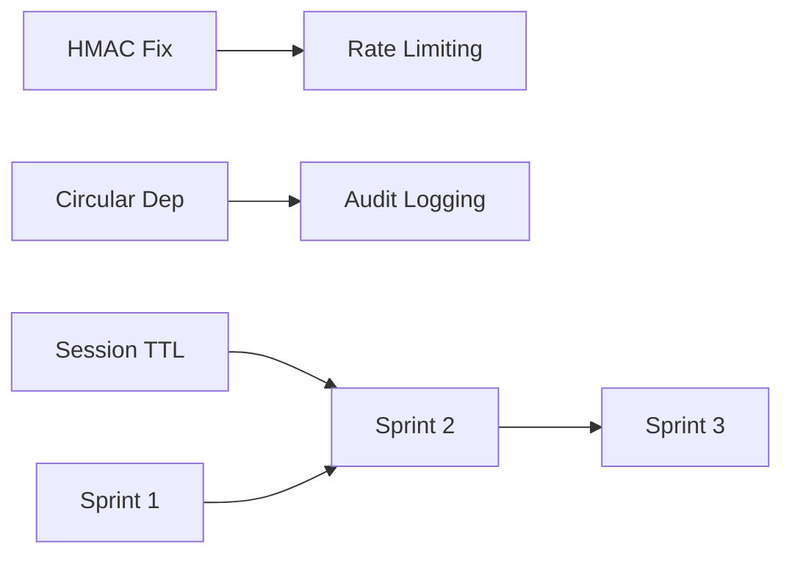

# Telegram Integration - Sprint Plan

> **Generated**: 2026-01-03
> **Based on**: TELEGRAM_ANALYSIS_REPORT.md v1.1.0
> **Total Issues**: 13 (3 P0, 6 P1, 4 P2)

---

## Sprint Overview

| Sprint | Focus | Duration | Issues |
|--------|-------|----------|--------|
| **Sprint 1** | Security & Critical Fixes | 3-4 days | 6 issues |
| **Sprint 2** | Code Quality & Tests | 5-6 days | 4 issues |
| **Sprint 3** | Features & Integrations | 5-7 days | 3 issues |

---

## Sprint 1: Security & Critical Fixes

**Goal**: Fix all P0 security vulnerabilities and critical architecture issues

### Day 1-2: Security Fixes

| # | Task | Priority | File | Status |
|---|------|----------|------|--------|
| 1.1 | Remove HMAC bypass in dev mode | P0 | `client-auth.service.ts:225-236` | ⏳ |
| 1.2 | Add @Throttle to client auth endpoints | P0 | `client-auth.controller.ts` | ⏳ |
| 1.3 | Add audit logging to admin callbacks | P1 | `telegram-admin-callback.service.ts` | ⏳ |

### Day 2-3: Architecture Fixes

| # | Task | Priority | File | Status |
|---|------|----------|------|--------|
| 1.4 | Fix circular dependency | P0 | `telegram-commerce.module.ts` | ⏳ |
| 1.5 | Fix session TTL inconsistency | P1 | `telegram-session.service.ts` | ⏳ |
| 1.6 | Add missing database indexes | P2 | New migration | ⏳ |

### Acceptance Criteria

- [ ] All auth endpoints have rate limiting
- [ ] No dev mode bypasses in production code
- [ ] No circular dependencies
- [ ] Admin actions are audited
- [ ] Session TTL uses constants value

---

## Sprint 2: Code Quality & Tests

**Goal**: Eliminate code duplication and achieve 80% test coverage

### Day 1-2: Code Consolidation

| # | Task | Priority | Files | Status |
|---|------|----------|-------|--------|
| 2.1 | Consolidate translation systems | P1 | `telegram-ui.service.ts`, `telegram-i18n.service.ts` | ⏳ |
| 2.2 | Merge keyboard generators | P1 | `telegram-ui.service.ts`, `telegram-keyboard.handler.ts` | ⏳ |

### Day 3-5: Test Coverage

| # | Task | Priority | Files | Status |
|---|------|----------|-------|--------|
| 2.3 | Create client-auth.controller tests | P1 | New spec file | ⏳ |
| 2.4 | Create client-orders.controller tests | P1 | New spec file | ⏳ |
| 2.5 | Create client-loyalty.controller tests | P1 | New spec file | ⏳ |
| 2.6 | Create client-public.controller tests | P1 | New spec file | ⏳ |
| 2.7 | Create client-promo.controller tests | P1 | New spec file | ⏳ |

### Acceptance Criteria

- [ ] Single translation system (TelegramI18nService)
- [ ] Single keyboard generator (TelegramKeyboardHandler)
- [ ] All client controllers have unit tests
- [ ] Test coverage >= 80%

---

## Sprint 3: Features & Integrations

**Goal**: Implement high-value features from cross-repository analysis

### Week 1: Core Features

| # | Task | Priority | Source | Status |
|---|------|----------|--------|--------|
| 3.1 | Implement /sales command | HIGH | VH24 | ⏳ |
| 3.2 | Add response caching | HIGH | AIAssistant | ⏳ |
| 3.3 | Implement workflow automation | HIGH | AIAssistant | ⏳ |

### Week 2: Advanced Features

| # | Task | Priority | Source | Status |
|---|------|----------|--------|--------|
| 3.4 | Add NLP queries (/ask) | MEDIUM | data-parse-desk | ⏳ |
| 3.5 | Location-based discovery | MEDIUM | vendify-menu-maps | ⏳ |
| 3.6 | Formula engine | LOW | data-parse-desk | ⏳ |

### Acceptance Criteria

- [ ] Operators can submit sales via Telegram
- [ ] API responses cached for performance
- [ ] Automated workflows for common tasks
- [ ] NLP queries working for basic questions

---

## Implementation Details

### P0-1: Remove HMAC Bypass

**Current Code** (`client-auth.service.ts:225-236`):
```typescript
// VULNERABLE
const isDev = this.configService.get('NODE_ENV') === 'development';
if (isDev && hash !== expectedHash) {
  this.logger.warn('⚠️ SECURITY WARNING: Telegram hash validation BYPASSED');
}
```

**Fixed Code**:
```typescript
// SECURE - Always validate
if (hash !== expectedHash) {
  this.logger.warn('Invalid Telegram hash - authentication rejected');
  return null;
}
```

---

### P0-2: Add Rate Limiting

**Current Code** (`client-auth.controller.ts`):
```typescript
@Post('telegram')
async authenticateTelegram(@Body() dto: TelegramAuthDto)
```

**Fixed Code**:
```typescript
import { Throttle } from '@nestjs/throttler';

@Post('telegram')
@Throttle({ short: { ttl: 1000, limit: 3 } })
async authenticateTelegram(@Body() dto: TelegramAuthDto)

@Post('refresh')
@Throttle({ medium: { ttl: 10000, limit: 5 } })
async refreshToken(@Body() body: { refresh_token: string })
```

---

### P0-3: Fix Circular Dependency

**Current Code** (`telegram-commerce.module.ts:28`):
```typescript
forwardRef(() => TelegramModule), // CIRCULAR
```

**Fixed Code**:
```typescript
TelegramNotificationsModule, // Direct import
```

Also update `telegram.module.ts` to import `TelegramCommerceModule`.

---

### P1-1: Add Audit Logging

**Add to** `telegram-admin-callback.service.ts`:
```typescript
import { AuditLogService } from '@modules/audit-logs/audit-log.service';

constructor(
  private readonly auditLogService: AuditLogService,
  // ... other deps
) {}

// In handleApproveUser:
await this.auditLogService.log({
  action: 'ACCESS_REQUEST_APPROVED',
  user_id: adminUserId,
  target_id: userId,
  metadata: { role, telegram_id: telegramId }
});
```

---

### P1-2: Fix Session TTL

**Update** `telegram-session.service.ts`:
```typescript
import { TELEGRAM_SESSION_TTL } from '../shared/constants/telegram.constants';

// Replace hardcoded value
private readonly SESSION_TTL = TELEGRAM_SESSION_TTL; // Uses 86400 from constants
```

---

## Risk Assessment

| Risk | Probability | Impact | Mitigation |
|------|-------------|--------|------------|
| Breaking existing bot | Medium | High | Feature flags, staged rollout |
| Test failures after refactoring | Medium | Low | Run tests after each change |
| Performance regression | Low | Medium | Cache benchmarks before/after |

---

## Dependencies



---

## Success Metrics

| Metric | Before | Target | Sprint |
|--------|--------|--------|--------|
| Security Score | 6.5/10 | 9/10 | 1 |
| Test Coverage | ~80% | 90% | 2 |
| Code Duplication | High | Low | 2 |
| New Features | 0 | 3 | 3 |

---

**Document Version**: 1.0.0
**Created**: 2026-01-03
**Owner**: VendHub Development Team
