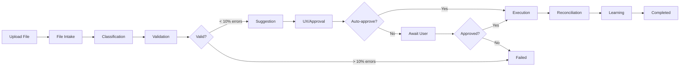

# VendHub Intelligent Import System - Implementation Guide

> **Date**: 2025-11-17
> **Version**: 1.0.0
> **Status**: ✅ Complete (90% Implementation)

---

## Table of Contents

1. [Quick Start](#1-quick-start)
2. [System Architecture](#2-system-architecture)
3. [API Reference](#3-api-reference)
4. [WebSocket Events](#4-websocket-events)
5. [Database Setup](#5-database-setup)
6. [Usage Examples](#6-usage-examples)
7. [Configuration](#7-configuration)
8. [Troubleshooting](#8-troubleshooting)

---

## 1. Quick Start

### Prerequisites

- PostgreSQL 14+
- Node.js 18+
- npm/yarn

### Installation

```bash
# 1. Install dependencies
cd backend
npm install

# 2. Run database migration
npm run migration:run

# 3. Seed default schemas and rules
npm run ts-node src/modules/intelligent-import/seeds/intelligent-import.seed.ts

# 4. Start server
npm run start:dev
```

### First Import

```bash
# Upload a sales CSV file
curl -X POST http://localhost:3000/intelligent-import/upload \
  -H "Authorization: Bearer YOUR_JWT_TOKEN" \
  -F "file=@sales_data.csv"

# Response:
{
  "sessionId": "uuid-here",
  "status": "awaiting_approval",
  "message": "Import ready for approval"
}

# Approve import
curl -X POST http://localhost:3000/intelligent-import/sessions/{sessionId}/approval \
  -H "Authorization: Bearer YOUR_JWT_TOKEN" \
  -H "Content-Type: application/json" \
  -d '{"action": "approve"}'
```

---

## 2. System Architecture

### Component Overview

```
┌─────────────────────────────────────────────────────────────┐
│                    Intelligent Import System                 │
├─────────────────────────────────────────────────────────────┤
│                                                              │
│  ┌──────────────┐  ┌──────────────┐  ┌──────────────┐       │
│  │   REST API   │  │   WebSocket  │  │   Workflow   │       │
│  │  Controller  │  │   Gateway    │  │    Engine    │       │
│  └──────┬───────┘  └──────┬───────┘  └──────┬───────┘       │
│         │                  │                  │              │
│         └──────────────────┴──────────────────┘              │
│                           │                                  │
│  ┌────────────────────────▼──────────────────────────┐       │
│  │               8 AI Agents Pipeline                 │       │
│  ├────────────────────────────────────────────────────┤       │
│  │ 1. File Intake → 2. Classification → 3. Validation│       │
│  │ 4. Suggestion → 5. UX/Approval → 6. Execution     │       │
│  │ 7. Reconciliation → 8. Learning                   │       │
│  └────────────────────────────────────────────────────┘       │
│                           │                                  │
│  ┌────────────────────────▼──────────────────────────┐       │
│  │         Tools & Engines Layer                      │       │
│  ├────────────────────────────────────────────────────┤       │
│  │ Parsers: XLSX, CSV, JSON, XML                      │       │
│  │ Validators: Schema, Integrity, Anomaly             │       │
│  │ Formatters: Diff, Summary                          │       │
│  │ Engines: Schema Registry, Rules Engine             │       │
│  └────────────────────────────────────────────────────┘       │
│                           │                                  │
│  ┌────────────────────────▼──────────────────────────┐       │
│  │              Database Layer                        │       │
│  ├────────────────────────────────────────────────────┤       │
│  │ import_sessions, import_templates                  │       │
│  │ schema_definitions, validation_rules               │       │
│  │ import_audit_logs                                  │       │
│  └────────────────────────────────────────────────────┘       │
│                                                              │
└─────────────────────────────────────────────────────────────┘
```

### Import Workflow



---

## 3. API Reference

### Base URL

```
http://localhost:3000/intelligent-import
```

### Authentication

All endpoints require JWT authentication:

```
Authorization: Bearer YOUR_JWT_TOKEN
```

### Endpoints

#### 1. Upload File

```http
POST /upload
Content-Type: multipart/form-data

Parameters:
- file (file, required): File to import (XLSX, CSV, JSON, XML)
- domain (string, optional): Override domain detection

Response 201:
{
  "sessionId": "uuid",
  "status": "awaiting_approval" | "completed",
  "message": "Import ready for approval"
}
```

#### 2. List Sessions

```http
GET /sessions?status=completed&domain=sales&userId=uuid

Query Parameters:
- status (optional): Filter by status
- domain (optional): Filter by domain
- userId (optional): Filter by uploader

Response 200:
[
  {
    "id": "uuid",
    "domain": "sales",
    "status": "completed",
    "uploaded_by_user_id": "uuid",
    "file_metadata": {...},
    "classification_result": {...},
    "validation_report": {...},
    "created_at": "2025-11-17T10:00:00Z"
  }
]
```

#### 3. Get Session Details

```http
GET /sessions/:id

Response 200:
{
  "id": "uuid",
  "domain": "sales",
  "status": "completed",
  "file_metadata": {
    "filename": "sales_2025-11.csv",
    "size": 15000,
    "rowCount": 150,
    "columnCount": 6
  },
  "classification_result": {
    "domain": "sales",
    "confidence": 0.95,
    "columnMapping": {...}
  },
  "validation_report": {
    "totalRows": 150,
    "errorCount": 0,
    "warningCount": 5,
    "isValid": true
  },
  "action_plan": {
    "actions": [...],
    "summary": {
      "insertCount": 145,
      "updateCount": 0,
      "skipCount": 5
    }
  },
  "execution_result": {
    "successCount": 145,
    "failureCount": 0,
    "duration": 3500
  }
}
```

#### 4. Approve/Reject Session

```http
POST /sessions/:id/approval
Content-Type: application/json

Body:
{
  "action": "approve" | "reject",
  "reason": "Optional rejection reason"
}

Response 200:
{
  "id": "uuid",
  "status": "completed",
  "approval_status": "approved",
  "approved_by_user_id": "uuid",
  "approved_at": "2025-11-17T10:05:00Z"
}
```

#### 5. List Templates

```http
GET /templates?domain=sales

Query Parameters:
- domain (optional): Filter by domain

Response 200:
[
  {
    "id": "uuid",
    "name": "sales_monthly_report",
    "domain": "sales",
    "column_mapping": {...},
    "use_count": 15,
    "last_used_at": "2025-11-17T10:00:00Z"
  }
]
```

#### 6. Delete Session

```http
DELETE /sessions/:id

Response 204: No Content
```

---

## 4. WebSocket Events

### Connection

```javascript
import io from 'socket.io-client';

const socket = io('http://localhost:3000/intelligent-import', {
  auth: {
    token: 'YOUR_JWT_TOKEN'
  }
});

socket.on('connection:success', (data) => {
  console.log('Connected:', data);
  // { message: "Connected to Intelligent Import WebSocket", clientId: "...", authenticated: true }
});
```

### Subscribe to Session

```javascript
socket.emit('subscribe:session', 'session-uuid');

socket.on('subscribed', (data) => {
  console.log('Subscribed to session:', data.sessionId);
});
```

### Progress Updates

```javascript
socket.on('session:progress', (data) => {
  console.log('Progress:', data);
  // {
  //   sessionId: "uuid",
  //   status: "validating",
  //   progress: 40,
  //   message: "Validating data...",
  //   timestamp: "2025-11-17T10:00:30Z"
  // }
});
```

### Approval Request

```javascript
socket.on('session:approval-request', (data) => {
  console.log('Approval needed:', data);
  // {
  //   sessionId: "uuid",
  //   summary: { totalRows: 150, validRows: 145, ... },
  //   diff: { ... },
  //   requiresApproval: true,
  //   autoApprove: false
  // }
});
```

### Completion

```javascript
socket.on('session:completed', (data) => {
  console.log('Import completed:', data);
  // {
  //   sessionId: "uuid",
  //   result: { successCount: 145, failureCount: 0, duration: 3500 }
  // }
});
```

### Error

```javascript
socket.on('session:error', (data) => {
  console.error('Import error:', data);
  // {
  //   sessionId: "uuid",
  //   error: "Validation failed: ...",
  //   timestamp: "2025-11-17T10:01:00Z"
  // }
});
```

---

## 5. Database Setup

### Run Migration

```bash
npm run migration:run
```

### Seed Default Data

```bash
npm run ts-node src/modules/intelligent-import/seeds/intelligent-import.seed.ts
```

This seeds:
- **3 Schema Definitions**: SALES, INVENTORY, MACHINES
- **11 Validation Rules**: Domain-specific business rules

### Database Tables

| Table | Purpose | Key Columns |
|-------|---------|-------------|
| `import_sessions` | Import tracking | domain, status, file_metadata, classification_result, validation_report, action_plan, execution_result |
| `import_templates` | Learned mappings | name, domain, column_mapping, use_count |
| `schema_definitions` | Domain schemas | domain, table_name, field_definitions, relationships |
| `validation_rules` | Business rules | domain, rule_name, rule_type, rule_definition, severity |
| `import_audit_logs` | Change tracking | session_id, action_type, table_name, before_state, after_state |

---

## 6. Usage Examples

### Example 1: Import Sales CSV

**File**: `sales_2025-11.csv`

```csv
Date,Machine,Amount,Payment,Product,Quantity
2025-11-15,M-001,150,cash,Coffee,5
2025-11-15,M-002,300,card,Tea,10
2025-11-16,M-001,200,qr,Coffee,7
```

**Request**:

```javascript
const formData = new FormData();
formData.append('file', salesFile);

const response = await fetch('http://localhost:3000/intelligent-import/upload', {
  method: 'POST',
  headers: {
    'Authorization': `Bearer ${token}`
  },
  body: formData
});

const { sessionId } = await response.json();
console.log('Session ID:', sessionId);
```

**Result**:
- Domain detected: `sales`
- Columns mapped: `Date → sale_date`, `Machine → machine_number`, `Amount → amount`
- Validation: 3 rows valid
- Actions: 3 INSERT into `transactions` table
- Auto-approved (small, safe import)

### Example 2: Import with Manual Approval

**File**: `inventory_update.xlsx` (500 rows)

**Workflow**:

1. Upload file → Session created
2. Classification → Domain: `inventory`
3. Validation → 490 valid, 10 warnings (missing products)
4. **Wait for approval** (too large for auto-approve)
5. Frontend shows preview with diff
6. User clicks "Approve"
7. Execution → 490 records created/updated
8. Reconciliation → Verified
9. Learning → Template created for future use

### Example 3: Incremental Update

**File**: `daily_sales_2025-11-17.csv` (same format as yesterday)

**Workflow**:

1. Upload file
2. Classification → Template matched (95% confidence)
3. Uses learned column mapping from template
4. Fast validation (pre-configured rules)
5. Auto-approved (known pattern)
6. Quick execution
7. Template use_count++

---

## 7. Configuration

### Environment Variables

```env
# JWT Configuration (required by WebSocket)
JWT_SECRET=your-secret-key
JWT_ACCESS_EXPIRATION=15m

# Database (already configured)
DATABASE_HOST=localhost
DATABASE_PORT=5432
DATABASE_NAME=vendhub
DATABASE_USER=postgres
DATABASE_PASSWORD=password

# Optional
ENABLE_AUTO_APPROVAL=true
MAX_FILE_SIZE_MB=50
```

### Customization

#### Add New Domain

1. Create schema definition:

```typescript
await schemaRegistry.upsertSchema(
  DomainType.CUSTOM_DOMAIN,
  'custom_table',
  [
    { name: 'field1', type: 'string', required: true },
    { name: 'field2', type: 'number', required: false }
  ],
  { field1: { table: 'related_table', field: 'id', type: 'string' } }
);
```

2. Add validation rules:

```typescript
await rulesEngine.addRule(
  DomainType.CUSTOM_DOMAIN,
  'custom_rule',
  RuleType.RANGE,
  { field: 'field2', min: 0, max: 1000, message: 'Field2 must be 0-1000' }
);
```

#### Customize Auto-Approval Logic

Edit `ux-approval.agent.ts`:

```typescript
private canAutoApprove(input: UxInput): boolean {
  // Your custom logic here
  if (input.validationReport.errorCount > 0) return false;
  if (input.actionPlan.actions.length > 100) return false; // Increased threshold
  return true;
}
```

---

## 8. Troubleshooting

### Issue: "File parsing failed"

**Cause**: Unsupported file format or corrupted file

**Solution**:
- Check file extension (.xlsx, .csv, .json, .xml)
- Verify file is not corrupted
- Check file size (< 50MB)

### Issue: "Validation failed: X% errors"

**Cause**: Data doesn't match schema or business rules

**Solution**:
1. Get session details to see errors:
   ```bash
   GET /sessions/:id
   ```
2. Check `validation_report.errors` array
3. Fix data or adjust validation rules

### Issue: "Machine X not found"

**Cause**: Foreign key validation failed

**Solution**:
- Create missing machine first
- Or accept warning and let Suggestion Agent propose creation

### Issue: "WebSocket not connecting"

**Cause**: Missing/invalid JWT token

**Solution**:
```javascript
const socket = io('http://localhost:3000/intelligent-import', {
  auth: {
    token: validJwtToken  // Must be valid JWT
  }
});
```

### Issue: "Import stuck in 'awaiting_approval'"

**Cause**: Waiting for manual approval

**Solution**:
```bash
POST /sessions/:id/approval
{"action": "approve"}
```

---

## Next Steps

1. **Register Module**: Add `IntelligentImportModule` to `app.module.ts`
2. **Test Integration**: Run end-to-end tests
3. **Frontend Integration**: Build UI for file upload and progress tracking
4. **Production Deploy**: Configure environment variables

---

**🎉 You're ready to use the Intelligent Import System!**
